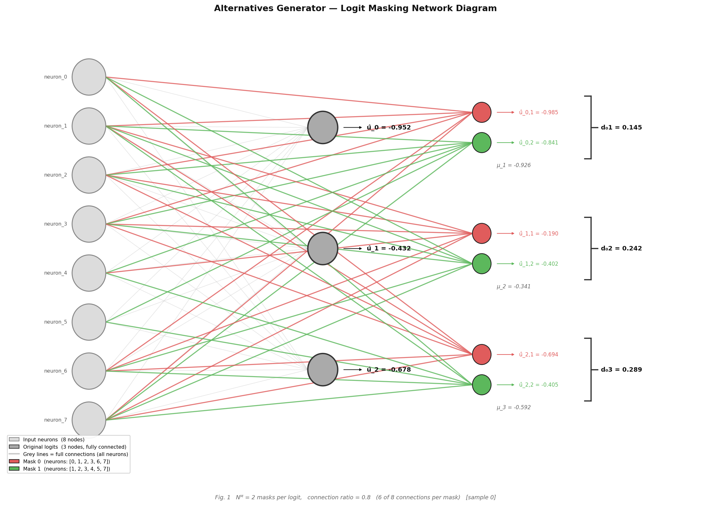

# Alternatives Generator for ANN

**Master Research Project — RCSE, TU Ilmenau**

---

## 1. Project Overview

A trained neural network always produces an output — even when it should not
be trusted. When the input data comes from a different distribution than the
training data, or when the input is completely irrelevant to the task, the
model still gives a confident answer with no warning.

This project builds a module that addresses this problem. It extends the
output layer of any existing neural network by generating **masked
alternatives** for each output logit. By comparing these alternatives, the
module produces a measure of how certain or uncertain the model's output is.

The implementation is based on the logit masking concept introduced in:

> Yousef, Q. & Li, P. *Prospect certainty for data-driven models.*
> Scientific Reports 15, 8278 (2025).
> https://doi.org/10.1038/s41598-025-89679-6

---

## 2. Key Idea — Alternatives via Masking

A normal output logit is **fully connected**: it receives signals from every
neuron in the previous layer and produces one value.

A **masked alternative** is a partial copy of that logit. It receives signals
from only a randomly chosen subset of the previous layer's neurons. It sees
only part of the picture and therefore produces a slightly different value.

By generating several such alternatives and comparing their values, the module
can detect:

- **Consistent output** — all alternatives produce similar values.
  The model is stable. Its output can be trusted.

- **Uncertain output** — alternatives produce very different values.
  The model is sensitive to which inputs it sees. Its output should be
  treated with caution.

This comparison is the foundation of the uncertainty estimation method.

---

## 3. Method

### Original logits

The base linear layer computes its output normally using all connections:

```
y_original = x @ W.T + b
```

### Masked logits

For each mask `m` and each logit `i`, a binary matrix selects which input
connections to keep. All others are set to zero:

```
masked_weight = original_weight * binary_mask
y_masked[m]  = x @ masked_weight.T + b
```

The key principle: masks reuse the **original trained weights**. They do not
have independent random weights. This means any disagreement between
alternatives is caused by genuine sensitivity to the input, not by noise.

### Mean and spread

For each logit, the module computes:

```
all_alternatives = [original, mask_0, mask_1, ..., mask_n]

mean   = average of all alternatives
spread = max(all alternatives) - min(all alternatives)
```

### Uncertainty interpretation

```
spread is LOW  →  alternatives agree  →  model is CONSISTENT (certain)
spread is HIGH →  alternatives disagree →  model is UNCERTAIN
```

The overall uncertainty score per input sample is the mean spread across
all logits. This is one scalar that summarises model certainty for that sample.

---

## 4. Implementation

### LogitMaskingLayer (reusable module)

Located at: `src/alternatives_generator/logit_masking.py`

This is the core scientific contribution. It is fully general and reusable.
It wraps **any** `torch.nn.Linear` layer, regardless of size. The dimensions
are inferred automatically — the user never specifies them.

```python
from src.alternatives_generator import LogitMaskingLayer

base = nn.Linear(128, 10)   # any size
layer = LogitMaskingLayer(
    base_layer       = base,
    num_masks        = 3,      # masks per logit
    connection_ratio = 0.5,    # fraction of connections per mask
)

x   = torch.randn(4, 128)
out = layer(x)

# out.original     shape: (4, 10)
# out.masked       shape: (4, 10, 3)
# out.mean         shape: (4, 10)
# out.spread       shape: (4, 10)
# out.uncertainty  shape: (4,)
```

The module returns a `MaskingOutput` dataclass with five named fields.
All fields are PyTorch tensors, ready for further computation.

### run_masking.py (demonstration script)

Located at: `run_masking.py`

This script is fixed for demonstration. The model and input are predefined:

```python
base_layer = nn.Linear(8, 3)    # fixed: 8 inputs, 3 logits
x          = torch.randn(4, 8)  # fixed: 4 samples
```

The user is asked only two questions at runtime:

```
Number of masks per logit    [default: 3]
Connection ratio (0.1–0.9)   [default: 0.5]
```

Everything else is handled internally.

---

## 5. How to Run

### Setup

```bash
# Create and activate virtual environment
python3 -m venv .venv
source .venv/bin/activate

# Install dependencies
pip install torch numpy pytest
```

### Run the demonstration

```bash
python run_masking.py
```

You will be asked two questions. Press Enter to accept the defaults.

### Run the tests

```bash
pytest tests/test_logit_masking.py -v
```

---

## 6. Example Output

```
█████████████████████████████████████████████████████████████████
  Alternatives Generator for ANN
  LogitMaskingLayer — Demonstration
  RCSE Master Research Project, TU Ilmenau
█████████████████████████████████████████████████████████████████

  USER INPUT

  Number of masks per logit [default: 3]: 3
  Connection ratio (0.1 – 0.9) [default: 0.5]: 0.5

  INPUT PARAMETERS
  Model (fixed for demo):
    base_layer   : nn.Linear(8, 3)
    input x      : torch.randn(4, 8)
  User parameters:
    num_masks        : 3
    connection_ratio : 0.5
    n_connections    : 4  (= round(8 × 0.5) per mask per logit)

  ORIGINAL LOGITS  —  fully connected, no masking
    Sample       logit_0    logit_1    logit_2
    sample_0    +0.3241    -0.1872    +0.5034
    sample_1    -0.2108    +0.4417    -0.1923
    ...

  SPREAD  —  max − min across alternatives per logit
    sample_0    0.4123   0.5871   0.3290    uncertainty: 0.4428  consistent
    sample_1    0.8912   1.2341   0.7654    uncertainty: 0.9636  UNCERTAIN
    ...
```

---

## 7. Project Structure

```
alternatives_generator/
│
├── src/
│   └── alternatives_generator/
│       ├── __init__.py          public API
│       └── logit_masking.py     LogitMaskingLayer module
│
├── demo/
│   └── step1_masks_demo.py      visual prototype (Step 1)
│
├── tests/
│   └── test_logit_masking.py    automated tests
│
├── run_masking.py               demonstration script
└── README.md
```

---

## 8. Reusability

The module can be integrated into any PyTorch model by wrapping the final
linear layer. The model itself does not need to be changed or retrained.

```python
import torch.nn as nn
from src.alternatives_generator import LogitMaskingLayer

class MyModel(nn.Module):
    def __init__(self):
        super().__init__()
        self.hidden  = nn.Linear(64, 32)
        self.relu    = nn.ReLU()
        self.output  = nn.Linear(32, 5)
        self.masking = LogitMaskingLayer(
            base_layer       = self.output,
            num_masks        = 3,
            connection_ratio = 0.5,
        )

    def forward(self, x):
        h   = self.relu(self.hidden(x))
        out = self.masking(h)   # returns MaskingOutput
        return out

model = MyModel()
result = model(torch.randn(8, 64))
print(result.uncertainty)   # (8,) — one certainty score per sample
```

---

## 9. Limitations

- The current implementation covers **logit masking only** (Step 1 of the
  full prospect certainty pipeline).
- The spread value is a raw uncertainty signal. It has not yet been
  transformed into the final certainty score Ω (Omega) from the paper.
- The module wraps `nn.Linear` layers only. Convolutional output layers
  are not yet supported.
- Mask connections are fixed after initialisation. They do not adapt
  during training or deployment.

---

## 10. Future Work

The full pipeline from the paper involves four steps. This project
implements Step 1. The remaining steps are:

| Step | Component | Description |
|------|-----------|-------------|
| 2 | Weighted Probability | Score each alternative by proximity to group mean |
| 3 | Behavior Function | Measure alignment with training distribution via Wasserstein distance |
| 4 | Prospect Certainty Ω | Combine scores using Kahneman-Tversky Prospect Theory |

When all four steps are implemented, the module will:
- Output a refined logit value (the most certain alternative)
- Output a calibrated certainty score Ω per logit
- Handle both regression and classification tasks

---

## Dependencies

| Package | Purpose |
|---------|---------|
| `torch` | Module implementation, tensor operations |
| `pytest` | Automated testing |

```bash
pip install torch pytest
```

---

## Reference

Yousef, Q. & Li, P. (2025). Prospect certainty for data-driven models.
*Scientific Reports*, 15, 8278.
https://doi.org/10.1038/s41598-025-89679-6

Authors' original code: https://doi.org/10.5281/zenodo.14541878

---

## 11. Graphical Output

Running `python run_masking.py` automatically generates and saves a network
diagram to `demo/logit_masking_network.png`.

### What the diagram shows

The diagram has three columns:

**Left column — Input neurons** (grey circles)
One circle per input neuron. Labels show `neuron_0` through `neuron_N`.

**Middle column — Original logits** (larger grey circles)
One circle per output logit. Fully connected to all input neurons.
Labels show the computed value: `û_0 = +0.324`

**Right column — Mask nodes** (small coloured circles)
Each logit has `num_masks` mask alternatives.
Each mask has a unique colour shared between its circle, its connections,
and its label.
Labels show: `û_0,1 = +0.182`

### Connection lines

| Line colour | Meaning |
|---|---|
| Grey | Full connection — this input connects to the original logit |
| Coloured | Masked connection — this input connects to this specific mask |
| No line | This input was not selected for this mask |

The coloured lines make it immediately visible which neurons each mask
can "see" and which are hidden from it.

### Annotations

**μ_i (mean)** — the average value across the original logit and all its
masks. Placed below each mask cluster.

**d_i (spread)** — the range (max − min) across all alternatives for
logit i. Shown in the bracket on the right side.
A large d_i means the alternatives disagree — the model is uncertain.
A small d_i means they agree — the model is consistent.

### Example diagram


